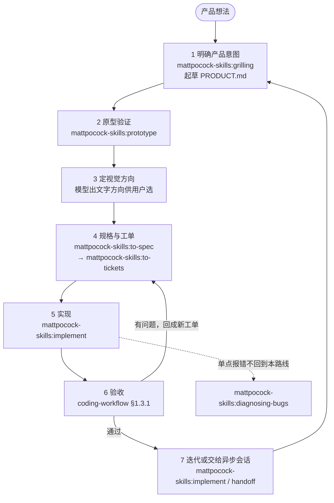

# AI 产品开发路线

本 skill 仅在用户显式调用时执行。

本文件只给路线和每一步的入口，每一步具体怎么做由它指定的 skill 承担，不在这里复述。

## 路线图

## 每一步调什么

| 步 | 调用 | 谁发起 | 产出 |
|---|---|---|---|
| 1 产品意图 | `mattpocock-skills:grilling` | 模型自动 | 拷问出目标、用户、首版范围与核心用户路径 |
| 1 产品上下文 | 直接起草 `PRODUCT.md` | 模型自动 | 项目根的 `PRODUCT.md`（意图、用户、首版范围、核心路径），后续每一步都读它 |
| 2 原型 | `mattpocock-skills:prototype` | 模型自动 | 可点的原型：逻辑问题出单文件状态机，界面问题出多套变体 |
| 3 视觉方向 | 模型出 2–3 套文字方向描述（气质/配色/排版/密度各一句） | 用户选 | 选定的视觉方向写进 `PRODUCT.md`，后面实现照它走 |
| 4 规格 | `mattpocock-skills:to-spec` | 用户手敲 | 发到工单系统的规格，含明确不做 |
| 4 工单 | `mattpocock-skills:to-tickets` | 用户手敲 | tracer-bullet 工单，每张声明阻塞边 |
| 5 实现 | `mattpocock-skills:implement` | 用户手敲 | 按工单落地，一次一张 |
| 6 验收 | `coding-workflow` §1.3.1 | 模型自动 | QA 计划、逐条验收结果、回成新工单的问题 |
| 7 迭代 | `mattpocock-skills:implement` | 用户手敲 | 下一轮 |
| 7 交给异步会话 | `mattpocock-skills:handoff` | 用户手敲 | 另一个会话接手的交接文档 |

标`用户手敲`的步骤，模型给出该敲的命令后等用户敲。

## 路线的判据

- **第 2、3 步不跳**：没有能点的原型、没有定下来的视觉方向就进第 5 步，返工在第 5 步付，那里最贵。
- **单点故障不回到本路线**：某处报错、性能回退、偶发失败，走 `mattpocock-skills:diagnosing-bugs`。
- **代码库形态是后来的事**：模块怎么切、接口放哪里，等第一版跑通再提示用户运行 `/mattpocock-skills:improve-codebase-architecture`，不在第 2、3 步提前做。
